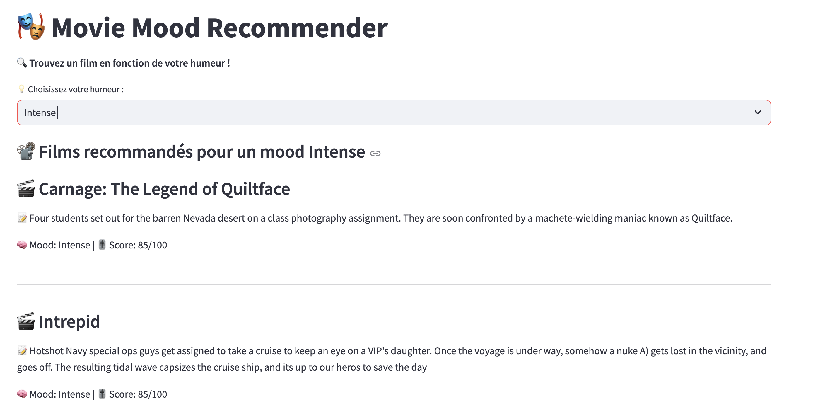
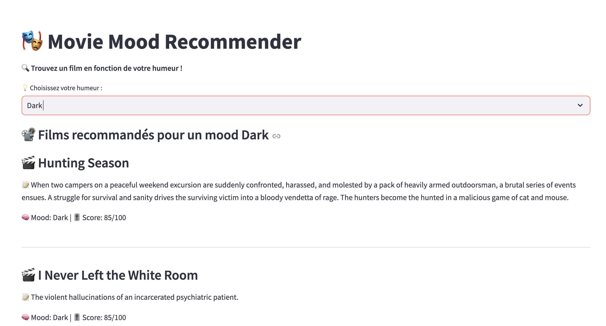

# 🎬 Movie Data Pipeline with AI-Powered Mood Analysis

## 🚀 Project Overview


This project is a **cloud-based data pipeline** that ingests, processes, and analyzes movie data from The Movie Database (TMDb) API. The workflow automates the extraction, transformation, and loading (ETL) of movie information into Google Cloud Platform (GCP), and enhances it using **AI-powered mood classification** with Vertex AI.

### **🔹 Key Features**
✅ **Automated ETL Pipeline**: Uses **Airflow** to extract movie data from the *TMDb API* and load it into **Google Cloud Storage (GCS)** and **BigQuery**.  
✅ **Cloud Infrastructure with Terraform**: All cloud resources are provisioned using **Terraform**, ensuring reproducibility and scalability.  
✅ **AI-powered Mood Classification**: **Vertex AI** and **Generative AI** analyze movie overviews to classify their mood (e.g., Happy, Intense, Dark) and store the results in BigQuery.  
✅ **Interactive Streamlit App**: Users can explore movies and receive AI-driven recommendations based on mood.  

---

## 📊 **System Architecture**
The architecture consists of three main layers:
1. **Data Ingestion (ETL Pipeline) : orchestrated by Airflow**
   - Airflow fetches movie data from TMDb API.
   - Data is stored in **Google Cloud Storage (GCS)** as JSON files.
   - The data is loaded into **BigQuery** for further processing.

2. **AI Processing**
   - **Vertex AI** analyzes movie overviews using a **Large Language Model (LLM)**.
   - Each movie receives a **mood classification** (e.g., Happy, Intense, Nostalgic).
   - The processed data is updated in BigQuery.

3. **Frontend - Movie Recommendation App**
   - A **Streamlit app** allows users to search for movies.
   - Users receive **AI-powered movie recommendations** based on mood classification.
   - Data is fetched in real-time from BigQuery.

---

## 🛠️ **Prerequisites**
Before setting up the project, ensure you have the following:

### **1️⃣ Install Required Tools**
#### 🔹  **Python**
Make sure you have **Python 3.8+** installed. You can download it from the official website: [Download Python](https://www.python.org/downloads/)
#### 🔹  **Docker & Docker Compose**
Docker is required to run **Airflow** and other services locally. Install **Docker** and **Docker Compose** from the official website:[Install Docker & Docker Compose](https://docs.docker.com/get-docker/)
After installation, verify that Docker is running:

```sh
docker --version
docker compose version
```
#### 🔹  **Terraform**
Terraform is used for cloud **infrastructure provisioning**. You can install it using `pip`:
```sh
pip install terraform
```
Alternatively, you can download Terraform from the official website: [Install Terraform](https://developer.hashicorp.com/terraform/tutorials/aws-get-started/install-cli)
After installation, verify Terraform:
```sh
terraform --version
```


### **2️⃣ Create a TMDb API Key**
- Sign up at **[TMDb Developers](https://developer.themoviedb.org/docs/getting-started)**
- Generate an **API Key** to access the movie database.
- Save the API key for later use in **Airflow variables**.

### **3️⃣ Set Up Google Cloud Platform (GCP)**
1. **Create a GCP Project**:  
   - Go to **[Google Cloud Console](https://console.cloud.google.com/)** and create a new project.

2. **Create a Service Account**:  
   - Navigate to **IAM & Admin > Service Accounts**.
   - Create a service account and assign the following roles:
     - **BigQuery Admin**
     - **Storage Admin**
     - **Vertex AI User**
   - Generate a **JSON key file** for authentication.

3. **Enable Required APIs**:  
   - Go to **APIs & Services** in GCP and enable:
     - **BigQuery API**
     - **Cloud Storage API**
     - **Vertex AI API**

4. **Store Credentials in the Project**:
   - Copy the **JSON key file content** into:
     - `airflow/keys/my-creds.json`
     - `infrastructure/keys/my-creds.json`
   - This allows both **Airflow and Terraform** to authenticate with GCP.


---

## 🚀 **Getting Started**
### **1️⃣ Clone the Repository**
```sh
git clone  
cd movie-recommendation-project
```

## **2️⃣ Setting Up Cloud Infrastructure with Terraform**

This project uses **Terraform** to provision the necessary cloud resources, including:

- **Google Cloud Storage (GCS)** for data storage
- **BigQuery** for data warehousing and processing
- **Vertex AI** for machine learning models

### **🔹 Step 1: Navigate to the Infrastructure Folder**
First, navigate to the **infrastructure** directory:

```sh
cd infrastructure
```
### **🔹 Step 2: Navigate to the Infrastructure Folder**
Before initializing Terraform, you need to edit the `variables.tf` file to customize the settings for your Google Cloud Platform (GCP) project.
Make sure to replace:
- `name_of_your_project` with your GCP project ID.
- `unique_name_of_your_bucket` with a unique name for your GCS bucket.
- `name_of_your_dataset` with a unique name for your BigQuery dataset.
- `./keys/my-creds.json` Ensure the service account key exists in the correct path.

### **🔹 Step 3: Initialize and Deploy Infrastructure**
Run the following Terraform commands inside the infrastructure folder to deploy the resources:

1. Initialize Terraform
```sh
terraform init
```
This command downloads necessary Terraform providers and dependencies.

2. Plan the Deployment
```sh
terraform plan
```
This step previews the resources Terraform will create.

3. Apply Changes and Create Resources
```sh
terraform apply
```
Terraform will prompt for confirmation. Type yes to proceed.

4. Verify the Infrastructure After deployment, you can verify that the resources are created by running:

```sh
terraform show
```
You can also check your GCP Cloud Storage (GCS) and BigQuery console to confirm the setup.


### **3️⃣ Setting Up Airflow for Data Orchestration**

This project uses **Apache Airflow** to orchestrate the data pipeline, ensuring smooth ingestion from **TMDB API** to **Google Cloud Storage (GCS)** and **BigQuery**.

### **🔹 Step 1: Navigate to the Airflow Folder**
First, move to the **Airflow directory**:

```sh
cd airflow
```
### **🔹 Step 2: Configure Airflow Variables**

Airflow requires Google Cloud credentials to interact with GCS, BigQuery, and Vertex AI.

1. Ensure that the service account key is available at:

- `airflow/keys/my-creds.json`

2. Set the environment variable in Airflow containers: Open the docker-compose.yaml file and add the following line inside environment for each container that needs access:

```yaml
environment:
  - GOOGLE_APPLICATION_CREDENTIALS=/opt/airflow/keys/my-creds.json
```

3. Mount the keys/ directory in Docker volumes: Ensure the following line is in docker-compose.yaml:

```yaml
volumes:
  - ${AIRFLOW_PROJ_DIR:-.}/keys:/opt/airflow/keys
```

### **🔹 Step 3: Start Airflow Services**

Run the following commands inside the airflow/ directory:

1.  **Initialize the Airflow database**

```sh
docker-compose up airflow-init
```

2.  **Start all Airflow services**

```sh
docker-compose up -d
```

3.  **Verify that all services are running**

```sh
docker ps
```

You should see the following containers running:

`airflow-webserver`
`airflow-scheduler`
`airflow-worker`
`airflow-triggerer`
`airflow-postgres`
`airflow-redis`

4.  **Access the Airflow UI Open your browser and navigate to:**

```arduino
http://localhost:8080
```

Login with:

Username: `airflow`
Password: `airflow`

### **🔹 Step 4: Install Required Python Libraries in Airflow**
Since Airflow runs in Docker containers, you need to install additional dependencies inside the running containers.

1.  **Attach to the airflow-worker container (or any other relevant container):**

```sh
docker exec -it airflow-airflow-worker-1 /bin/bash
```

2.  **Install required Python libraries:**

```sh
pip install google-cloud-bigquery google-cloud-storage google-cloud-aiplatform requests pandas
```

3.  **Exit the container:**

```sh
exit
```

### **🔹 Step 5: Deploy the Airflow DAG**
Your DAG (Directed Acyclic Graph) is responsible for:

- Extracting movie data from TMDB API.
- Storing it in Google Cloud Storage (GCS).
- Loading data into BigQuery for further processing.

1.  **Copy your DAG file into the dags/ directory: Ensure your DAG is inside:**

```bash
airflow/dags/upload_to_gcs_dag.py
```
2.  Trigger the DAG manually Go to Airflow UI (http://localhost:8080), navigate to the upload_to_gcs_dag DAG, and click "Trigger DAG".


### **🔹 Step 6: Stop and Restart Airflow**
To stop all running services:

```bash
docker-compose down
```

To restart:

```bash
docker-compose up -d
```

### **4️⃣ 🕰️ Backfilling Historical Movie Data (from 2000 to 2024)**

To populate the database with historical movie data from **TMDB API**, a **backfill process** was triggered using Apache Airflow.

This DAG is configured to run **yearly** (`@yearly`) starting from **January 1st, 2000**.

### ✅ Steps to Run the Backfill

1. **Start your Airflow environment**
    
    ```bash
    cd airflow
    docker-compose up -d
    ```
    
2. **Access the Airflow UI**
    - Open your browser and go to: [http://localhost:8080](http://localhost:8080/)
    - Login (default user/pass: `airflow` / `airflow`)
3. **Trigger backfill manually**
    - Go to the DAG named **`upload_to_gcs_dag`**
    - Ensure the DAG is **enabled (toggle is ON)**
    - Click on the **calendar icon** to choose a start and end date (e.g. from `2000-01-01` to `2025-01-01`)
    - Click **"Run"** to backfill historical data for each year
4. **Monitor progress**
    - Click on the DAG name to visualize task status
    - Use the **Graph View** to inspect each task (fetch, upload, load to BigQuery, merge)
5. ✅ Once finished, you will have one file per year (e.g. `movies_2000.json`, `movies_2001.json`, ...) in **Cloud Storage**, and the merged data in BigQuery under:
    
    ```markdown
    Dataset: movies
    Table: raw_movies
    ```

To populate the data from 2000 to the present, the DAG was **backfilled** using the `@yearly` schedule. This allowed historical data to be retrieved from the TMDB API, stored in GCS, and loaded into BigQuery.

Below is a screenshot of the Airflow UI during the backfilling process:


🔁 **Explanation:**

- ✅ Green: Successful task execution.
- 🟥 Red: Task failure due to issues like API overload or timeout.
- 🟧 Orange: Retry or temporarily failed tasks.

Sometimes the TMDB API becomes overloaded or rate-limited during long backfills, causing a few tasks to fail (red or orange boxes). In such cases, the DAG was manually restarted from the failed task using the Airflow UI.

👉 This demonstrates the robustness and observability of Airflow for managing large-scale, year-wise data ingestion pipelines.

---
## **5️⃣ 📌 AI-Powered Mood Annotation (Vertex AI + BigQuery)**

After ingesting and merging all movie data into the `raw_movies` table, we enrich the dataset by analyzing the **emotional tone** of each movie using **Google Vertex AI** and the **Gemini Pro** model.

This script generates two new columns:

- `mood`: the main emotional classification (e.g., *Intense*, *Sad*, *Uplifting*…)
- `mood_score`: a score from 0 to 100 indicating the intensity of the mood.

### 🧠 Script Location

📄 File: `scripts/generate_mood.py`

---

### ⚙️ How to Run the Script

1. **Make sure you have activated Vertex AI API** in your GCP project.
2. **Update the credentials path** at the top of the script:
    
    ```python
    
    os.environ["GOOGLE_APPLICATION_CREDENTIALS"] = "scripts/keys/my-creds.json"
    ```
    
3. **Install required packages** (if not already done):
    
    ```bash
    
    pip install -r requirements.txt
    ```
    
4. **Run the script**:
    
    ```bash
    
    python scripts/generate_mood.py
    ```
    

---

## **6️⃣ 🧹 Data Cleaning & Processing (BigQuery)**

Once the raw movie data is ingested into BigQuery through Airflow and Google Cloud Storage, multiple data cleaning and transformation steps are performed to prepare the dataset for analytics and AI-based recommendations.

### 🛠️ Key Cleaning & Transformation Steps

1. **🔄 Preprocessing in Airflow before BigQuery**
A significant part of the preprocessing is handled **upstream directly in the Airflow DAG**, before the data even lands in BigQuery:
    - The `get_movies` task in the DAG extracts structured movie data from the TMDB API.
    - It handles:
        - ✅ **Flattening nested fields** like genre IDs into human-readable names (using Airflow Variables and a dictionary).
        - ✅ **Default value imputation** for fields like `budget` and `revenue` (set to `0` when missing).
        - ✅ **Type normalization** (e.g., converting release years to integers, handling null dates).
        - ✅ **Data filtering**: Only movies with valid IDs and available metadata are included.
2. **🧼 Removing Duplicates in BigQuery**
Deduplication is done using `ROW_NUMBER()` to keep only the latest entry for each `movie_id`.
    
    ```sql
    
    CREATE OR REPLACE TABLE `movies.raw_movies_cleaned` AS
    SELECT *
    FROM (
      SELECT *,
        ROW_NUMBER() OVER(PARTITION BY movie_id ORDER BY release_date DESC) AS row_num
      FROM `movies.raw_movies`
    )
    WHERE row_num = 1;
    ```
    
3. **🔢 Budget & Revenue Normalization**
Replace `0` values with the column median using `APPROX_QUANTILES`, ensuring outliers don't skew the data.
    
    ```sql
    CASE
      WHEN budget = 0 THEN (SELECT APPROX_QUANTILES(budget, 100)[OFFSET(50)] FROM `movies.raw_movies_cleaned`)
      ELSE budget
    END AS budget
    ```
    
4. **📅 Date Parsing & Enrichment**
    - Standardize `release_date` using `DATE()` casting.
    - Extract `release_year` and `release_month` using BigQuery’s `EXTRACT()` function.
5. **🧾 Genre & Language Flattening**
    - Genres are exploded from arrays for frequency analysis and dashboard visualizations.
    - Language codes are standardized for pie chart breakdown.

---

### **7️⃣ 📊 Data Exploration Dashboard with Streamlit**

To better understand the movie dataset, a **Streamlit dashboard** was created to visualize key insights such as:

- 📅 Distribution of movies over the years and months
- 🎭 Most common genres
- 🌍 Language distribution

This interactive app is powered by **BigQuery** and **Google Cloud**, and allows users to explore the data effortlessly.

🖼️ Below is a screenshot of the dashboard:


🔧 **Technologies Used**:

- Streamlit
- Google BigQuery
- Pandas
- Altair / Matplotlib for plotting

🚀 **Launch the Streamlit Dashboard**

The dashboard is located in the `app/` folder and the script is named `streamlit_dashboard.py`.

To run the dashboard locally, follow these steps:

```bash
cd app
streamlit run streamlit_dashboard.py
```

Once launched, it will open a web page (usually at `http://localhost:8501`) showing:

- 📅 Movie distribution by release year and month
- 🎭 Top 10 movie genres
- 🌍 Language usage across the dataset

### **8️⃣ 🎭 AI-Powered Movie Mood Recommender**

This Streamlit application allows users to **discover movies based on their emotional mood**, using descriptions enhanced by **Vertex AI**. The LLM classifies each movie into moods like *Happy, Intense, Dark, Sad...* based on their synopsis, stored in BigQuery.

🧠 **How it works:**

- The Gemini model (via Vertex AI) analyzes the `overview` of each movie.
- Each film is automatically labeled with a `mood` and a `mood_score` (0–100).
- Users select a mood and receive AI-recommended films accordingly.

📁 **Location:**

`app/streamlit_app.py`

🚀 **To launch the app:**

```bash
cd app
streamlit run streamlit_app.py

```

🛡️ **Make sure to update the credentials path:**
In `streamlit_app.py`, set the correct path to your Service Account key JSON:

```python
os.environ["GOOGLE_APPLICATION_CREDENTIALS"] = "keys/my-creds.json"
```

📸 **Preview of the Mood Recommender App:**

**🔻 Intense Mood:**


**🔻 Dark Mood:**
